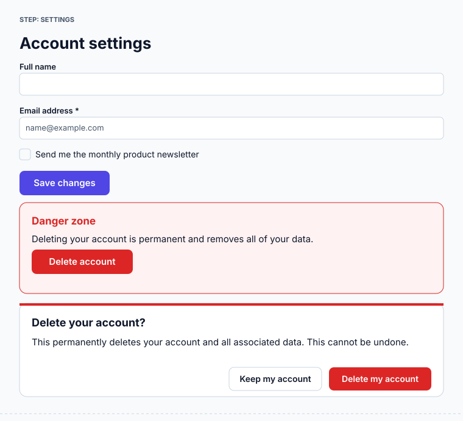

# design-playground

End-to-end demonstration of how **design intent becomes an
agent-managed user interface**, using a deliberately lightweight stack:
**JSON · SQLite · MCP · React**. Every phase produces tangible,
committed artifacts, and three independent layers keep generated UIs
safe and consistent with the design system.

```
Design Tokens → Component Metadata → Flow Definitions → SQLite Rule Store
→ MCP Design Server → Agent Planner → UI AST → JSON Schema Validation
→ React Renderer → Audit Logs
```

A natural-language request like *"I want to delete my account"* is
matched to a flow, governed by retrieved design rules, planned into a
validated UI AST, and rendered — while the destructive action is
automatically isolated in a danger zone and guarded by a confirmation
dialog, because the design rules require it.



See [`docs/architecture.md`](docs/architecture.md) for diagrams and the
rationale behind each choice.

## Quick start

### With devenv.sh (declarative environment)

```sh
devenv shell        # node 22, pnpm, sqlite, jq
setup               # pnpm install
pipeline            # tokens → db → scenarios → governance
demo                # start the React renderer on http://localhost:5173
```

### With plain Node + pnpm

```sh
pnpm install
pnpm pipeline       # regenerate every artifact deterministically
pnpm test           # 17 tests: validation, planner, SQLite enforcement
pnpm --filter @design-playground/renderer dev
```

### With Docker

```sh
docker compose up demo                 # built renderer at http://localhost:8080
docker compose run --rm pipeline       # regenerate artifacts (one-shot)
```

## What each phase produces

| Phase | Artifacts | Generated by |
| --- | --- | --- |
| 1. Design tokens | `tokens/design-tokens.json` (W3C DTCG) + schema, `tokens/css/variables.css` | `pnpm build:tokens` |
| 2. Component metadata | `components/{button,input,card,dialog,form}.json` + schema | authored |
| 3. Flow definitions | `flows/{onboarding,checkout,subscription-upgrade,account-settings,password-reset}.json` | authored |
| 4. SQLite rule store | `db/schema.sql`, `db/seed.ts`, `rules/design-rules.json` → `db/design.db` | `pnpm db:seed` |
| 5. MCP design server | `packages/mcp-server` (9 stdio tools), `.mcp.json` | — |
| 6. Agent planner | `packages/planner` (deterministic MCP client) | — |
| 7. UI IR | `ui-ir/ui-ast.schema.json`, validator + lints, examples | — |
| 8. Runtime renderer | `packages/renderer` (React + Vite) | `pnpm --filter renderer dev` |
| 9. Scenarios | `scenarios/<flow>/{request,retrieved-rules,planning-trace,ast,validation}.json`, `render.html`, `screenshot.svg` | `pnpm scenarios` + `pnpm screenshots` |
| 10. Governance | `governance/{audit-log.json,decision-traces/,explainability-report.md,safety-constraints.json,compliance-report.md}` | `pnpm governance` |

## Repository layout

```
tokens/        design tokens (source) + generated variables.css
components/     UI primitive metadata (purpose, variants, props, a11y, constraints)
flows/          the five user journeys (steps, fields, rule tags, error states)
rules/          design rules catalogue (+ JSON schema)
db/             SQLite schema, seed, and enforcement demo
ui-ir/          UI AST JSON Schema + example ASTs
packages/
  tokens-build  DTCG → CSS variables
  design-db     typed SQLite access + deterministic intent matching
  mcp-server    MCP tools over the rule store
  ui-ir         AST validator, semantic lints, HTML transform
  planner       deterministic agent planner (MCP client)
  renderer      React + Vite runtime renderer
scenarios/      committed end-to-end runs (one per flow) + a rejected demo
governance/     audit log, decision traces, explainability + compliance reports
scripts/        run-scenarios, generate-governance, take-screenshots
docs/           architecture documentation and diagrams
.claude/skills/ devenv + nix-cmd skills for agents
```

## The three enforcement layers

Generated UIs are kept safe and on-brand by three independent layers,
each enforced by code (full inventory in
[`governance/safety-constraints.json`](governance/safety-constraints.json)):

1. **Database (SQLite).** Foreign keys, CHECK constraints and triggers
   mean invalid design knowledge cannot even be stored — e.g. a
   destructive-action rule *must* set `requires_confirmation`, error
   states *must* carry recovery text, and the audit log is append-only.
   Prove it: `pnpm db:verify` attempts six violations and shows SQLite
   rejecting every one.
2. **Structure (JSON Schema).** The UI AST is a closed vocabulary
   (`ui-ir/ui-ast.schema.json`) with `additionalProperties:false`
   everywhere — there is no path to raw HTML, URLs, scripts or styles.
3. **Design rules (semantic lints).** Executable lints enforce the design
   intent: at most one primary action per screen, destructive actions
   guarded by a confirmation dialog, labelled fields, single-column
   forms, cost and renewal disclosure. Each lint links back to the rule
   that declares it via a shared `machineCheck` id.

The React renderer runs layers 2–3 on every AST and renders a
**rejection panel** instead of UI when an AST fails — invalid plans can
never reach the user.

## Using the MCP server interactively

The same design knowledge that drives the bundled planner is available
to any MCP client. `.mcp.json` registers the server for Claude Code:

```jsonc
{ "mcpServers": { "design": { "command": "npx", "args": ["tsx", "packages/mcp-server/src/server.ts"] } } }
```

Tools: `get_tokens`, `list_components`, `get_component`, `list_flows`,
`get_flow`, `match_intent`, `get_rules`, `validate_ast`, `log_decision`.
All reads are pure SQL, so retrieval is deterministic.

## Auditing an agent decision

For any generated screen the full chain is committed and inspectable:

1. `scenarios/<flow>/request.json` — request + interpreted intent
2. `scenarios/<flow>/retrieved-rules.json` — rules that governed each step
3. `scenarios/<flow>/planning-trace.json` — every MCP tool call and result
4. `scenarios/<flow>/validation.json` — what was checked and the verdict
5. `governance/explainability-report.md` — a human-readable summary
6. `governance/audit-log.json` — the append-only record

## Acceptance criteria

| Criterion | Where to verify |
| --- | --- |
| SQLite enforces rules | `pnpm db:verify`; `db/schema.sql` (triggers/checks/FKs) |
| MCP tools provide deterministic retrieval | `packages/mcp-server` (pure SQL reads) |
| ASTs validate | `scenarios/*/validation.json`; `pnpm test` |
| UIs obey constraints | renderer rejection panel; `scenarios/_rejected` |
| Audit logs explain decisions | `governance/` reports + audit log |
| Local reproduction succeeds | `pnpm install && pnpm pipeline` |

## Reproducibility

All derived artifacts (`variables.css`, `design.db`, `scenarios/*`,
`governance/*`) regenerate deterministically from the committed JSON
sources via `pnpm pipeline`. `db/design.db` is gitignored — it is a
regenerable binary and the pipeline writes timestamped audit rows into
it; its human-readable projections in `scenarios/` and `governance/` are
committed instead.

Screenshots are generated as native SVG using resolved token values, so
they rasterize anywhere with no browser. Run `npx playwright install
chromium` first and `pnpm screenshots` additionally emits PNGs of the
live renderer.

## Future extensions

- **LLM-backed planner.** Swap the deterministic intent/plan steps for a
  Claude-driven planner behind the same MCP tools — the validation and
  governance layers already constrain whatever it produces.
- **More node types and rules.** Tables, tabs, steppers; rules for empty
  states, loading, internationalisation, motion preferences.
- **Live design-token theming.** Multiple token sets (light/dark/brand)
  selectable at render time, all flowing through the same CSS variables.
- **CI gate.** Run `pnpm pipeline && pnpm test` on every change and fail
  if any scenario AST stops validating or any acceptance check regresses.
- **Visual regression.** Diff committed screenshots in CI.
