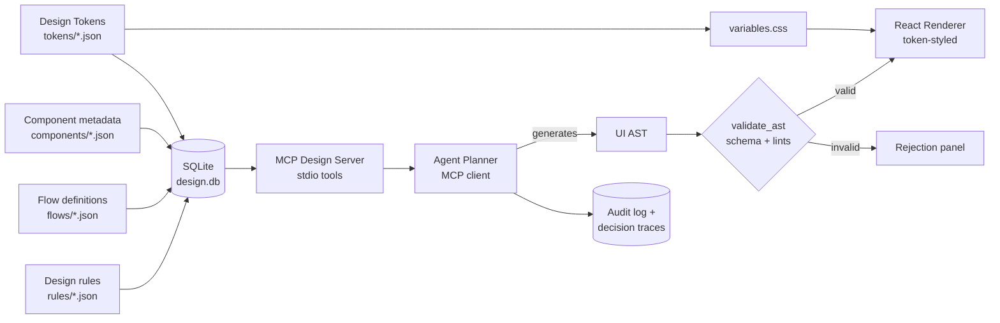
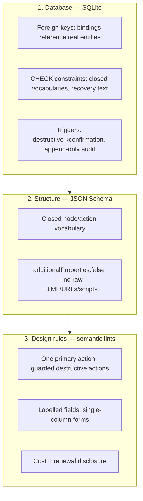
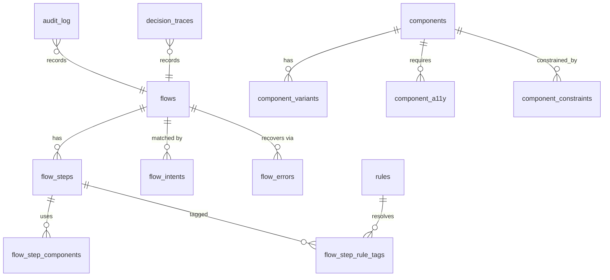

# Architecture

This project demonstrates how design intent becomes an agent-managed
interface using a deliberately small stack — **JSON, SQLite, MCP, and a
React renderer** — with tangible artifacts at every phase and three
independent enforcement layers that keep generated UIs safe and
on-brand.

## Pipeline

The same pipeline runs headless (`pnpm scenarios`) to produce committed
artifacts, and interactively (the MCP server is usable from Claude Code
via `.mcp.json`).

## Three enforcement layers (defence in depth)

A generated screen must pass all three before a user can see it. Each is
enforced by code, not convention — see `governance/safety-constraints.json`.

## Data model (SQLite)

`flow_step_components` and `flow_step_rule_tags` carry foreign keys back
to `components` and (via a trigger) to `rules`, so a flow cannot
reference a component or rule that does not exist.

## Why these choices

- **SQLite, not a graph DB or vector store.** The rule store is small and
  relational; CHECK constraints and triggers let the *database itself*
  enforce design invariants, which is the strongest, most auditable form
  of enforcement. No services to run.
- **MCP for retrieval.** Exposing the store as MCP tools makes retrieval
  deterministic (pure SQL) and lets the exact same design knowledge drive
  both the bundled deterministic planner and an interactive LLM agent
  (Claude Code) with no code changes.
- **A closed UI AST, not generated code/markup.** The agent can only
  assemble nodes from a fixed vocabulary, so there is no path to raw HTML,
  URLs, scripts or inline styles. The renderer can trust any AST that
  validates.
- **Deterministic planner by default.** No API key required; the pipeline
  is reproducible. The MCP server is the seam where an LLM can be swapped
  in for richer intent interpretation.

## Package layout

| Package | Role |
| --- | --- |
| `packages/tokens-build` | DTCG tokens → `variables.css` |
| `packages/design-db` | typed SQLite access + intent matching |
| `packages/mcp-server` | MCP tools over the rule store |
| `packages/ui-ir` | AST schema, validator, lints, HTML transform |
| `packages/planner` | deterministic planner (MCP client) |
| `packages/renderer` | React + Vite runtime renderer + Storybook |

The published site is **Storybook** (`pnpm site` → `site/`): the
Foundations docs (this page included), the component workbench, and the
live, validated generated screens — all rendered through the renderer's
own bindings and design tokens. Because Storybook emits relative asset
URLs it is served unchanged from the project sub-path.

## Reproducibility

`pnpm install && pnpm pipeline` regenerates every derived artifact
(`variables.css`, `design.db`, `scenarios/*`, `governance/*`) from the
committed JSON sources. `design.db` is gitignored because it is a
regenerable binary; its human-readable projections are committed.
